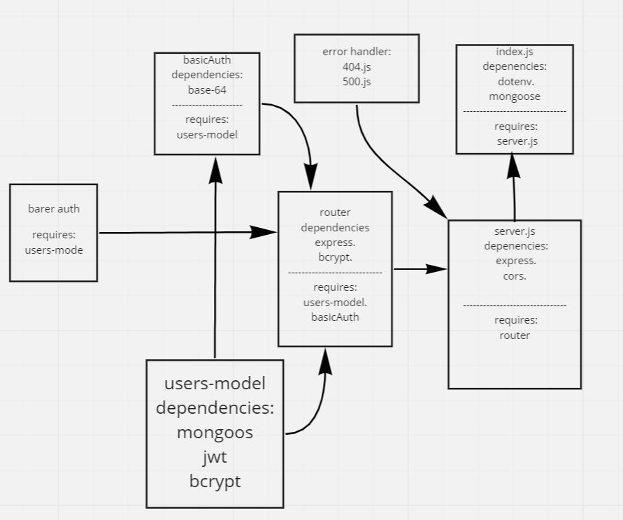

# bearer-auth
## Tasks:  
- Task 1: Fix The Bugs
- Task 2: Secure the JWT Tokens
## discription:  
add jason web token authorisation.  
## LINKS: 
- ['github actions'](https://github.com/awwadsaeed/bearer-auth/actions)
- [pull request](https://github.com/awwadsaeed/bearer-auth/pull/1)
- [heroku app](https://saeed-bearer-auth.herokuapp.com/)
## UML:  

